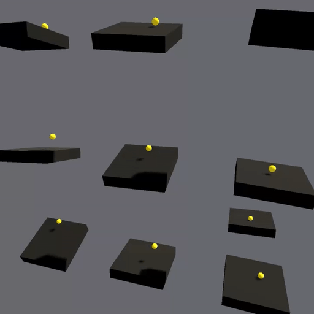

# ChaosRL – PPO Ball Balance Example with Zero Dependencies

A small experiment where an agent learns to balance a ball on a tilting platform.

Built mostly for fun and education — no external ML frameworks, and no performance optimization yet.  
Everything runs on top of a custom **autodiff engine** and a **minimal PPO implementation** written from scratch in C#.

---

### ✨ What’s inside
- Simple **continuous control task** – tilt a panel to keep a ball centered  
- **Autodiff engine** (scalar-based, dynamic graph)  
- **PPO** implementation with entropy bonus, value function, clipping, etc.  
- All code runs in **Unity / C#**, single-threaded  
- Focused on clarity rather than performance

---

### 👾 How to run
- Open the **Dojo** scene  
- There’s an **Academy** object that contains the main PPO implementation and config  
- An **ArenaSpawner** creates agents on play  
- Press **Play**  
- The policy should converge around **200k-300k steps** and total reward should reach 500-1000 on average
  _Note: there’s a chance the policy will initialize poorly and struggle to learn. 
   If rewards stay below 100, just restart the policy. 
   Usually it happens when *Entropy Loss* below 1.0_

---

### 🧠 Future plans
- Tensor backend with **vectorized ops (CPU)**
- **Multithreading** support for simulation and training
- **Compute shader** backend (GPU)
- Core plumbing: Agents, Academy, Save/Load, Configs, Telemetry

---

### 💡 Notes
This isn’t meant to be fast or production-ready yet — it’s a learning playground to understand how PPO and autodiff actually work under the hood.
